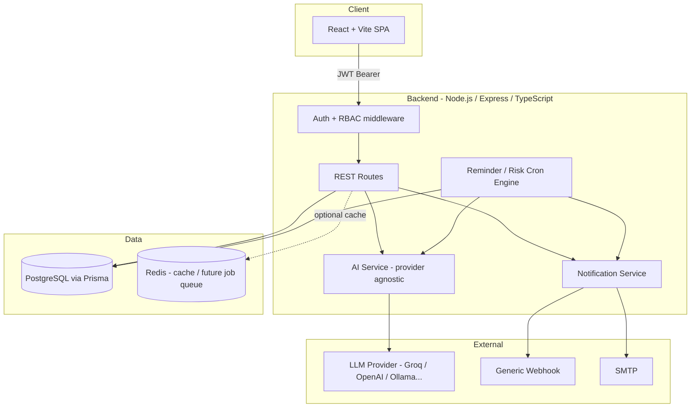
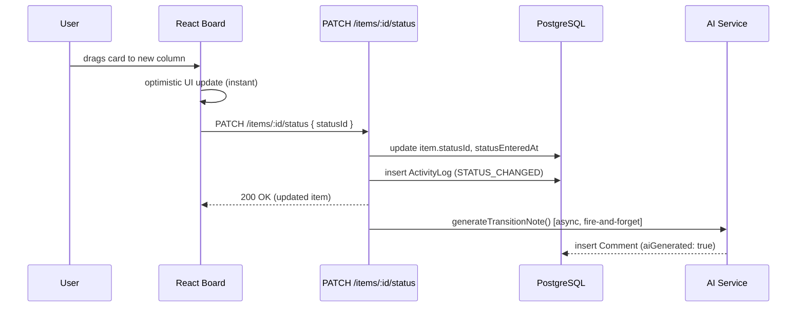

# Architecture

## System Overview

## Request Flow: Kanban Drag and Drop

## Key Decisions

- **Workflows and statuses are rows, not enums.** `Workflow` and `WorkflowStatus` are first-class Prisma models. Every "status" reference in the app (Kanban columns, dashboard grouping, reminder rules) is a foreign key, not a hardcoded string, so the platform genuinely supports "any workflow."
- **AI is provider-agnostic by construction.** `ai.service.ts` talks to any OpenAI-compatible chat completions endpoint. Swapping Groq for OpenAI, DeepSeek, or a local Ollama/LM Studio server is an environment variable change, not a code change. A deterministic offline fallback keeps every route functional without a live key.
- **Audit log is append-only.** `ActivityLog` rows are only ever created, never updated or deleted, satisfying the immutable-audit requirement.
- **Notification delivery is itself audited.** Every dispatch is persisted with a status (`PENDING`/`SENT`/`FAILED`), independent of whether the external channel (Slack, SMTP, etc.) is actually configured in a given environment, so the notification log stays meaningful in a demo/CI environment with no external credentials.
- **The reminder cron doubles as the bonus "AI agent" requirement.** The same hourly job that evaluates `IF status == X AND daysInStatus >= N THEN notify` rules also recomputes every active item's risk score and AI-suggested next action.
- **Readonly is enforced once, centrally.** `blockReadonlyWrites` middleware rejects any non-GET request from a Readonly user before it reaches a route handler, rather than relying on every handler to remember the check.
