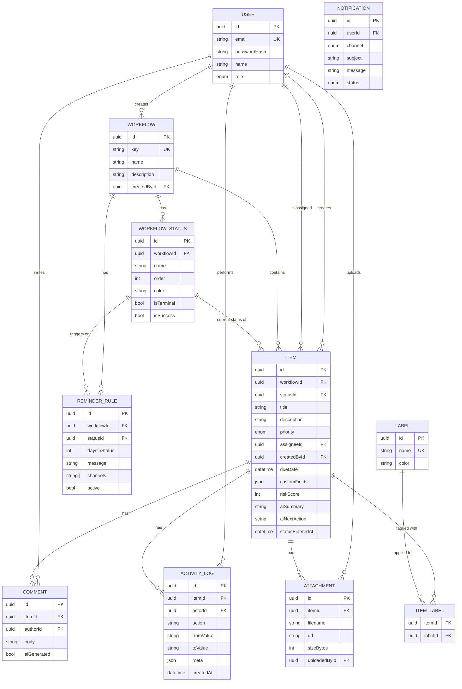

# Entity Relationship Diagram

```mermaid
erDiagram
    USER ||--o{ ITEM : "creates"
    USER ||--o{ ITEM : "is assigned"
    USER ||--o{ COMMENT : "writes"
    USER ||--o{ ACTIVITY_LOG : "performs"
    USER ||--o{ WORKFLOW : "creates"
    USER ||--o{ ATTACHMENT : "uploads"

    WORKFLOW ||--o{ WORKFLOW_STATUS : "has"
    WORKFLOW ||--o{ ITEM : "contains"
    WORKFLOW ||--o{ REMINDER_RULE : "has"

    WORKFLOW_STATUS ||--o{ ITEM : "current status of"
    WORKFLOW_STATUS ||--o{ REMINDER_RULE : "triggers on"

    ITEM ||--o{ COMMENT : "has"
    ITEM ||--o{ ATTACHMENT : "has"
    ITEM ||--o{ ACTIVITY_LOG : "has"
    ITEM ||--o{ ITEM_LABEL : "tagged with"
    LABEL ||--o{ ITEM_LABEL : "applied to"

    USER {
        uuid id PK
        string email UK
        string passwordHash
        string name
        enum role
    }
    WORKFLOW {
        uuid id PK
        string key UK
        string name
        string description
        uuid createdById FK
    }
    WORKFLOW_STATUS {
        uuid id PK
        uuid workflowId FK
        string name
        int order
        string color
        bool isTerminal
        bool isSuccess
    }
    ITEM {
        uuid id PK
        uuid workflowId FK
        uuid statusId FK
        string title
        string description
        enum priority
        uuid assigneeId FK
        uuid createdById FK
        datetime dueDate
        json customFields
        int riskScore
        string aiSummary
        string aiNextAction
        datetime statusEnteredAt
    }
    LABEL {
        uuid id PK
        string name UK
        string color
    }
    ITEM_LABEL {
        uuid itemId FK
        uuid labelId FK
    }
    COMMENT {
        uuid id PK
        uuid itemId FK
        uuid authorId FK
        string body
        bool aiGenerated
    }
    ATTACHMENT {
        uuid id PK
        uuid itemId FK
        string filename
        string url
        int sizeBytes
        uuid uploadedById FK
    }
    ACTIVITY_LOG {
        uuid id PK
        uuid itemId FK
        uuid actorId FK
        string action
        string fromValue
        string toValue
        json meta
        datetime createdAt
    }
    REMINDER_RULE {
        uuid id PK
        uuid workflowId FK
        uuid statusId FK
        int daysInStatus
        string message
        string[] channels
        bool active
    }
    NOTIFICATION {
        uuid id PK
        uuid userId FK
        enum channel
        string subject
        string message
        enum status
    }
```

Full source of truth: [backend/prisma/schema.prisma](../backend/prisma/schema.prisma).
